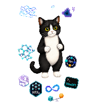

<table>
<tr>
<td width="68%" valign="middle">

# Preston · Maxwell3919

**Computational Materials · Electronic Structure · Research Workflows**

Student researcher working on electronic structure and density-functional theory,
with a focus on two-dimensional materials, superconductivity, and reproducible
research practice.

学生研究者，关注电子结构、密度泛函理论、二维材料与超导；也在把学习和科研中遇到的问题整理成公开、可审查的知识与工作流基础设施。

</td>
<td width="32%" align="center" valign="middle">

🐾 My Cat · Talos

</td>
</tr>
</table>

---

## Currently building · 当前建设

### Electronic Structure Atlas

A public map of electronic-structure foundations, continuous Core reading,
guided reading, research methods, computational tools, and reviewed references.

[Live site](https://maxwell3919.github.io/Electronic-Structure-Learning/) ·
[Repository](https://github.com/Maxwell3919/Electronic-Structure-Learning)

### DFT Research Workflow

A software-neutral, human-first manual for carrying out a DFT study from
structure and numerical setup through target calculations, validation,
interpretation, reproducibility, and preservation.

[Live site](https://maxwell3919.github.io/DFT-Research-Workflow/) ·
[Repository](https://github.com/Maxwell3919/DFT-Research-Workflow)

### Current research · 当前科研

My current research direction is centered on two-dimensional materials and
superconductivity, including electronic structure, phonons, density-functional
perturbation theory, and electron–phonon coupling. I treat convergence,
provenance, and the boundary between numerical evidence and scientific claims
as part of the research problem rather than as post-processing details.

## Earlier experiment · 早期探索

### Vibe-DFT-Skills

[Vibe-DFT-Skills](https://github.com/Maxwell3919/Vibe-DFT-Skills) is an earlier
experiment in evidence-aware AI4DFT tooling: portable Skills, deterministic
checks, provenance records, and workflow contracts for scientific agents.

Development is currently paused. The project made a useful point clear to me:
before automating DFT research more aggressively, the underlying workflow of a
reliable human researcher needs to be understood and expressed more precisely;
otherwise automation can solidify the wrong abstractions.

## How I work · 工作原则

- **Convergence is observable-specific.** A parameter that is adequate for one quantity does not automatically establish convergence for another.
- **Provenance and claim boundaries matter.** Inputs, parent calculations, transformations, and acceptance criteria should remain reviewable.
- **Automation supports scientific judgment.** Deterministic checks and agents can reduce mechanical work, but they do not replace scientific acceptance or interpretation.

## Tools · 工具

  
  
  
  

## GitHub activity

  

  Language statistics describe public repository contents; they are not a measure of proficiency.

🐾 · electrons · lattices · phonons · reproducible workflows · 🐾

<picture>
  <source media="(prefers-color-scheme: dark)" srcset="./profile/github-contribution-grid-snake-dark.svg" />
  <source media="(prefers-color-scheme: light)" srcset="./profile/github-contribution-grid-snake.svg" />
  
</picture>
