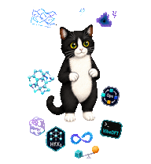

<table>
<tr>
<td width="68%" valign="middle">

# Preston · Maxwell3919

**Computational Materials · Electronic Structure**

I’m Preston, a student researcher studying electronic structure with
density-functional theory (DFT). I also build reference notes and tools around
the calculations I use and learn from.

</td>
<td width="32%" align="center" valign="middle">

🐾 My Cat · Talos

</td>
</tr>
</table>

---

## Current research

I’m interested in two-dimensional materials and superconductivity. My current
work involves electronic structure, phonons, density-functional perturbation
theory (DFPT), and electron–phonon coupling.

## Atlas

Atlas is the Chinese-language DFT
reference handbook I’m developing around practical calculation questions. It
connects physical questions with calculation methods and reproducible
post-processing, covering electronic structure, phonons, and electron–phonon
coupling among other material properties.

[Browse the handbook](https://maxwell3919.github.io/Atlas/) ·
[Repository](https://github.com/Maxwell3919/Atlas)

## Earlier projects

- **Electronic Structure Atlas** — notes on electronic-structure foundations,
  research methods, and computational tools. The public edition is a historical
  snapshot and is no longer actively maintained.
  [Former site](https://maxwell3919.github.io/Electronic-Structure-Learning/) (currently unavailable) ·
  [Repository](https://github.com/Maxwell3919/Electronic-Structure-Learning)
- **DFT Research Workflow** — a software-neutral guide to planning, running,
  interpreting, and preserving a DFT study. The public edition is also a
  historical snapshot and is no longer actively maintained.
  [Site](https://maxwell3919.github.io/DFT-Research-Workflow/) ·
  [Repository](https://github.com/Maxwell3919/DFT-Research-Workflow)
- **[Vibe-DFT-Skills](https://github.com/Maxwell3919/Vibe-DFT-Skills)** — an earlier
  experiment with portable skills and checks for AI-assisted DFT work.
  Development is paused.

## Tools

  
  
  
  

## GitHub activity

  

  Language statistics describe public repository contents; they are not a measure of proficiency.

🐾 · electrons · lattices · phonons · reproducible workflows · 🐾

<picture>
  <source media="(prefers-color-scheme: dark)" srcset="./profile/github-contribution-grid-snake-dark.svg" />
  <source media="(prefers-color-scheme: light)" srcset="./profile/github-contribution-grid-snake.svg" />
  
</picture>
